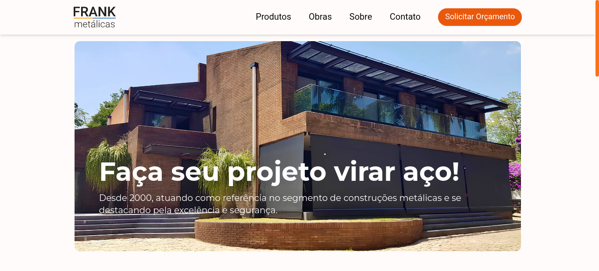

# Frank Metalicas Website

Welcome to the GitHub repository for the [Frank Metalicas](http://www.frankmetalicas.com) website. This project is a freelance website designed for a company specializing in steel and metal construction services. The site showcases their extensive experience and wide range of services.

<p align="center">
  
</p>

## Table of Contents

- [Overview](#overview)
- [Features](#features)
- [Technologies Used](#technologies-used)
- [Pages](#pages)
- [Installation](#installation)
- [Usage](#usage)
- [Contributing](#contributing)
- [License](#license)

## Overview

Frank Metalicas is a company with years of experience in providing a variety of steel and metal construction services. The website serves as a digital presence to highlight their services, completed projects, and company information.

## Features

- **Home Page**: Introduction to the company and overview of services.
- **Projects Page**: Showcases completed projects with descriptions and images.
- **About Page**: Detailed information about the company's history, mission, and team.
- **Contact**: Contact information available in the footer of every page.

## Technologies Used

- **Next.js**: A React framework for server-rendered applications.
- **React**: A JavaScript library for building user interfaces.
- **TypeScript**: A typed superset of JavaScript that compiles to plain JavaScript.
- **Tailwind CSS**: A utility-first CSS framework for rapid UI development.
- **Resend API**: Used for form handling and email sending.
- **Zod**: A TypeScript-first schema declaration and validation library.

## Pages

- **Home Page** (`/`): The main landing page introducing Frank Metalicas and their services.
- **Projects Page** (`/obras`): A portfolio of the company's completed projects.
- **About Page** (`/sobre`): Information about the company's background, mission, and team.
- **Contact Information**: Available in the footer on all pages.

## Installation

To set up the project locally, follow these steps:

1. **Clone the repository**:

   ```sh
   git clone https://github.com/giovannivicentin/fk_metalicas.git
   cd fk_metalicas
   ```

2. **Install dependencies**:

   ```sh
   npm install
   ```

3. **Run the development server**:
   ```sh
   npm run dev
   ```

The application should now be running on `http://localhost:3000`.

## Usage

- Navigate to the home page to learn about the services offered by Frank Metalicas.
- Visit the projects page to see the company's past work.
- Learn more about the company on the about page.
- Use the contact information in the footer to get in touch with Frank Metalicas.

## Contributing

We welcome contributions to improve the website. If you have suggestions or bug reports, please open an issue or submit a pull request.

1. **Fork the repository**.
2. **Create a new branch**:
   ```sh
   git checkout -b feature/your-feature-name
   ```
3. **Make your changes**.
4. **Commit your changes**:
   ```sh
   git commit -m 'Add some feature'
   ```
5. **Push to the branch**:
   ```sh
   git push origin feature/your-feature-name
   ```
6. **Open a pull request**.

## License

This project is licensed under the MIT License. See the [LICENSE](LICENSE) file for details.
